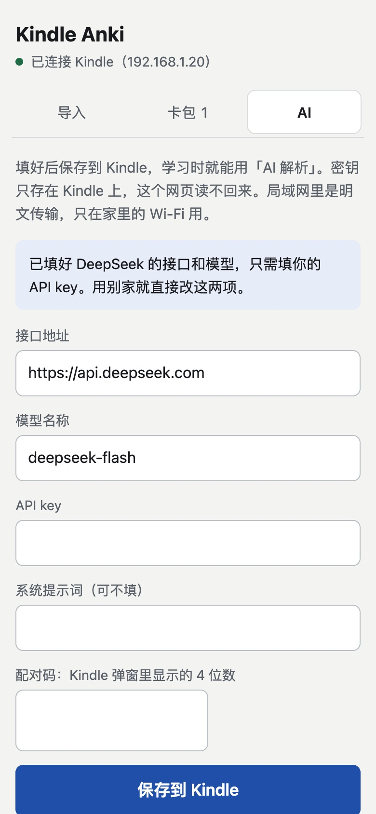
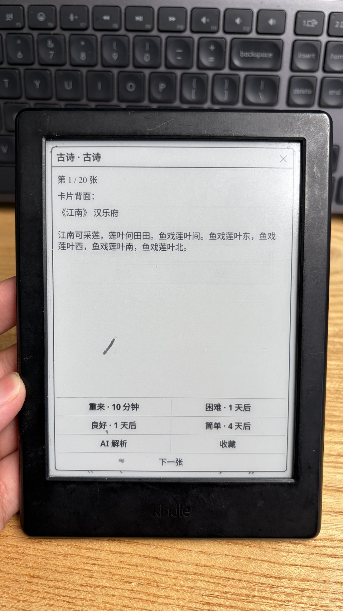
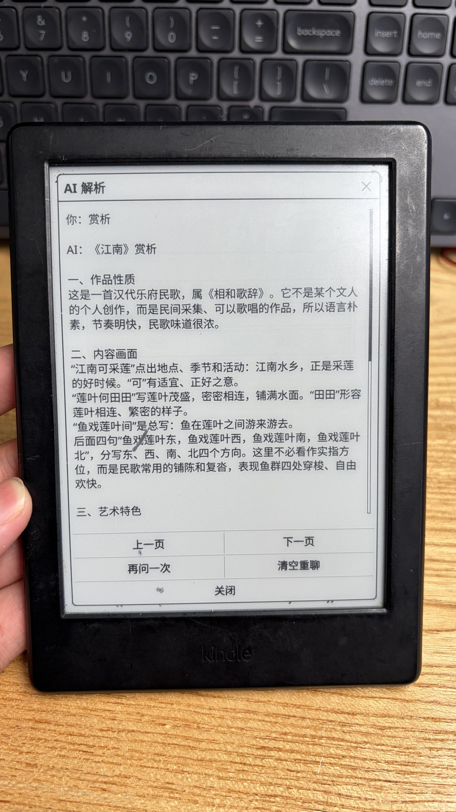
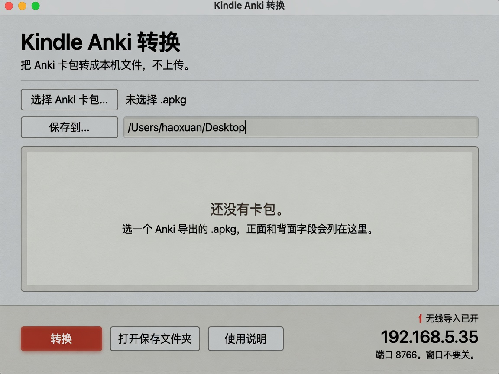
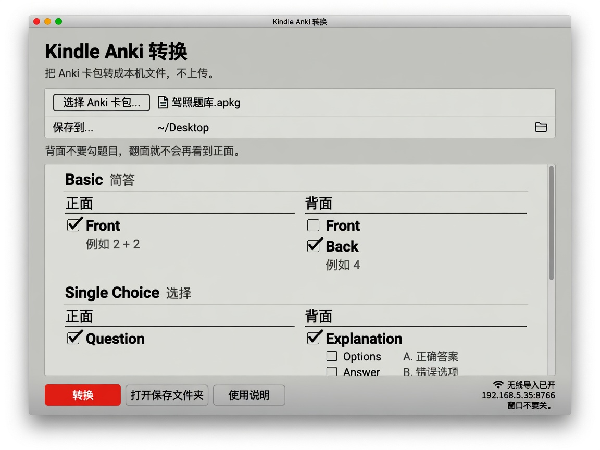
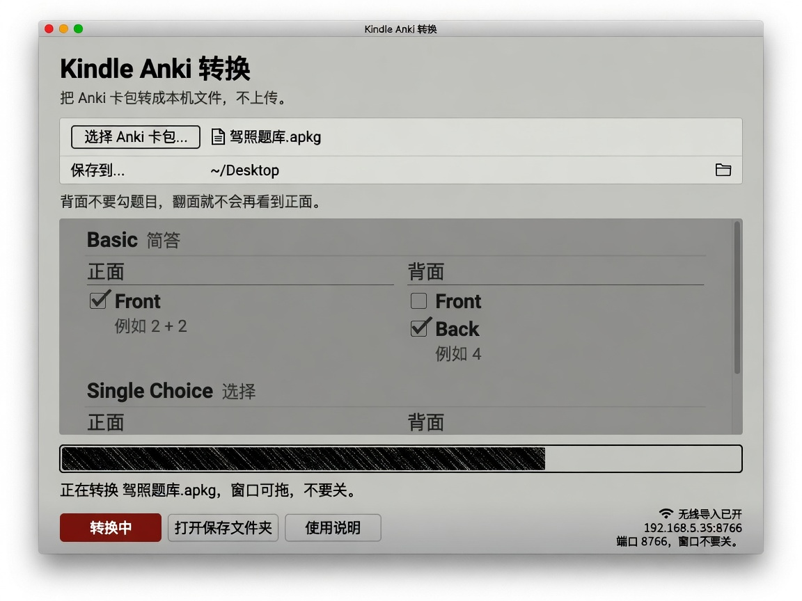
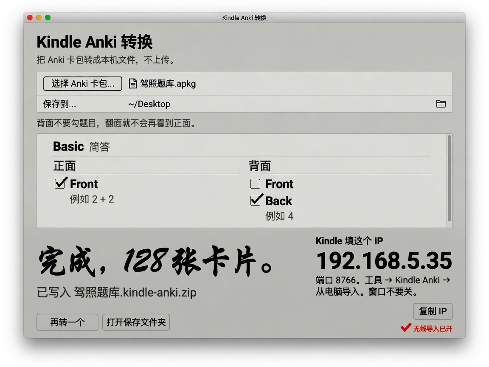

<p align="right">
  <a href="README.zh_CN.md">简体中文</a> · <strong>English</strong>
</p>

[](https://github.com/yizhixiaoheigou/kindle-anki/actions/workflows/ci.yml)

# Kindle Anki

Kindle Anki is a KOReader plugin that studies Anki `.apkg` decks (short-answer
and choice, with images) on a jailbroken Kindle. Scan a QR code on the Kindle
with your phone, pick the `.apkg` in the page that opens, and the converted
pack lands on the Kindle. Progress stays on the Kindle.

**Not official Anki. Not AnkiWeb-compatible. Not an Amazon product. Not an
official KOReader plugin.**

## Screenshots

The page the Kindle opens on your phone: pick the fields, check the Kindle
preview, send. The **AI** tab comes pre-filled for DeepSeek.

<p align="center">
  
  
</p>

On the Kindle (photos of an earlier version of the study screens):

<p align="center">
  
  
</p>

The optional computer converter:

<p align="center">
  
  
  
  
</p>

## Who this is for

- A jailbroken Kindle running [KOReader](https://github.com/koreader/koreader), the open-source reading system for Kindle.
- Anki decks you already have as `.apkg` — export them from desktop [Anki](https://apps.ankiweb.net/) (choice cards and images included).

This tool does not include or provide any jailbreaking methods; jailbreaking
is your own decision and your own risk.

## Requirements

- Jailbroken Kindle with KOReader. v2026.07 or newer shows card images inline;
  older builds show cards as plain text with a **View images** button.
- A phone or computer with a browser. Nothing to install.
- Kindle and phone on the same **home** Wi-Fi.

## Install the plugin

> Confused by tutorials? Give [SETUP_WITH_AI.md](docs/SETUP_WITH_AI.md) to any
> AI assistant, plug the Kindle into the computer over USB, and let it do the
> rest.

Unzip so `kindleanki.koplugin/` is a folder. Copy it to
`/mnt/us/koreader/plugins/kindleanki.koplugin/`. If upgrading from
`foloanki.koplugin`, delete the old folder. Eject. **Fully quit KOReader and
reopen.** The plugin is under **Tools → Kindle Anki**.

Details: [docs/USER_GUIDE.md](docs/USER_GUIDE.md). Old paths:
[docs/MIGRATION.md](docs/MIGRATION.md).

## Import packs

**Tools → Kindle Anki → Import packs** offers three ways:

- **Phone or computer browser (recommended).** The Kindle shows a QR code and
  its address (`http://<kindle-ip>:8767`). Scan it with the phone camera, pick
  the `.apkg`, tap **正面** / **背面** on the fields you want while a Kindle
  preview shows the first note, and tap **转换并发送到 Kindle**. The
  conversion runs inside the browser; the Kindle never unpacks Anki files.
  Scanned with WeChat or another in-app browser, the page explains how to
  switch to the real browser. Its **卡包** tab lists and deletes packs on the
  Kindle.
- **Computer converter over Wi-Fi.** Convert on a computer (below), keep the
  window open, and enter the IP it shows. Port 8766 has **no password** and is
  for home Wi-Fi only.
- **A file already on this Kindle.** Copy a `.kindle-anki.zip` over USB and
  pick it.

The page closes by itself after 30 minutes without visits.

### Computer converter (optional)

Prebuilt converter apps are unsigned local builds (a macOS universal2 `.app`
and a Windows onedir) — see [packaging/README.md](packaging/README.md). Without
one, install Python 3 with Tcl/Tk from python.org and use
`desktop/Kindle-Anki-Import.command` (macOS) or `desktop/Kindle-Anki-Import.bat`
(Windows). Pick `.apkg`, name the pack, map front/back fields, Convert.
Output: `name.kindle-anki.zip`.

## Study

**Tools → Kindle Anki → Open packs** lists your packs with what is left to
study today. A deck screen shows today's reviews and new cards; **Start
studying**, missed cards, starred cards, and browse-all carry their counts.
The first open asks for the daily new-card count (1–999). On a card, **Show
back** puts the answer under the question, and the four ratings sit in one
row with the next interval on each. Again = 10 minutes; Hard/Good/Easy use a
day-based SM-2. A round ends with a summary and offers the missed cards.
The menu has **Language / 语言** (Simplified Chinese or English).

## Optional AI

AI explanations use one set of settings saved on the Kindle; a pack's own AI
fields are ignored. Set them up from **Tools → Kindle Anki → AI settings**,
in one of three ways:

- **Phone or computer browser (recommended).** The Kindle shows a QR code and
  a 4-digit pairing code. Scan it, fill in endpoint, model, and API key on the
  page's **AI** tab, enter the code, and save. DeepSeek's endpoint and model
  are filled in until you set your own, so a DeepSeek user only pastes a key.
- **Computer converter over Wi-Fi.** Paste the config into the converter's
  **AI settings**, then enter the computer's IP and the converter's pairing
  code on the Kindle.
- **Type it on the Kindle.**

Requests go straight to `/v1/chat/completions`; card images are sent along as
base64. Thinking tags are hidden, not disabled. Pack JSON never carries keys.
Plain `http://` endpoints send the key unencrypted — prefer `https://`.

## Versus KAnki / anki.koplugin

This tool **converts existing `.apkg`** decks (choice + images) in a phone or
computer browser, or with a desktop converter, and reviews them in KOReader
with its own scheduler.

## Development

```bash
python3 -m unittest discover -s tests -p 'test_kindle_*.py'
```

The plugin tests need `lua` with luasocket, and the browser-converter tests
need `node`; without them those tests skip. `KINDLE_ANKI_REQUIRE_TOOLS=1`
makes them fail instead (CI sets it). `scripts/kindle-deploy.sh <kindle-ip>`
installs the plugin on a Kindle over KOReader's SSH server, no USB needed.
See [CONTRIBUTING.md](CONTRIBUTING.md). Pack format: [docs/PACK_FORMAT.md](docs/PACK_FORMAT.md).

## License

MIT. Copyright (c) 2026 yizhixiaoheigou. The KOReader plugin
(`plugin/kindleanki.koplugin/`) is licensed AGPL-3.0-or-later, like KOReader
itself. Third-party code and trademark notes:
[THIRD_PARTY_NOTICES.md](THIRD_PARTY_NOTICES.md).
