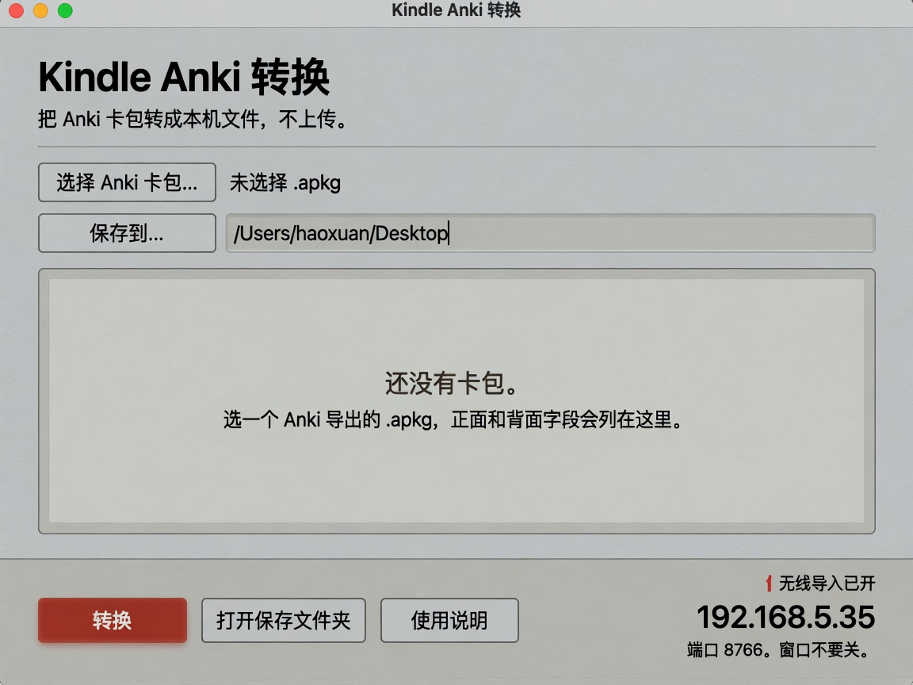
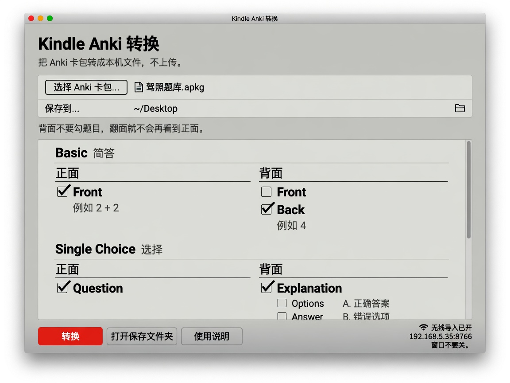
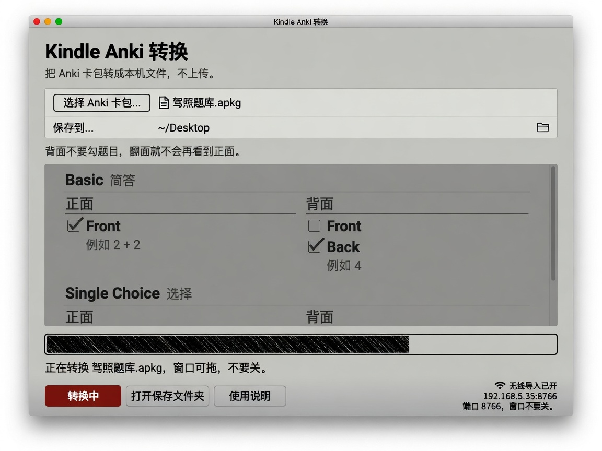
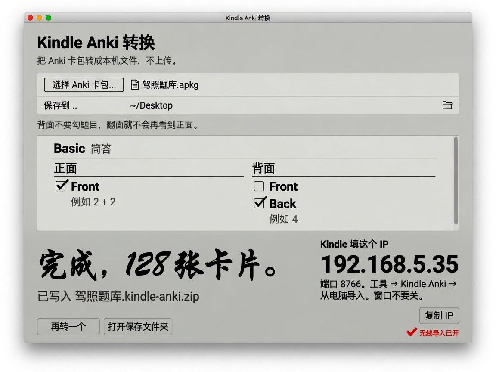
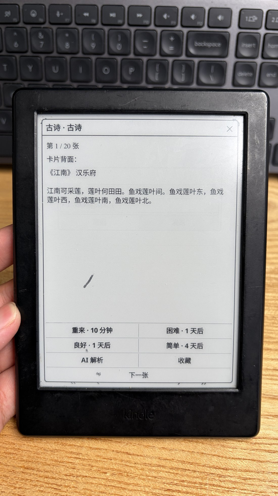
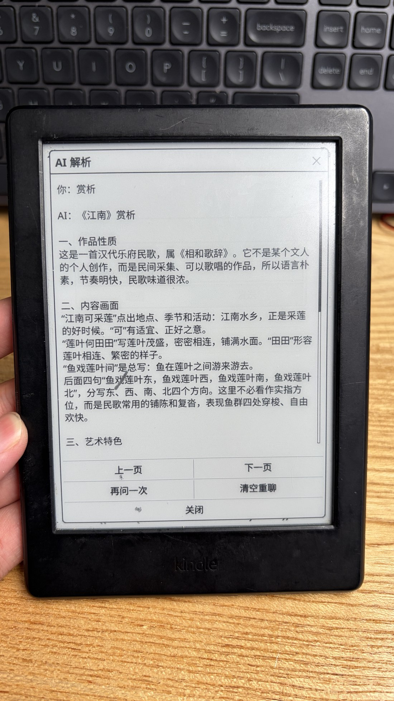

<p align="right">
  <strong>简体中文</strong> · <a href="README.md">English</a>
</p>

# Kindle Anki

在越狱 Kindle 的 KOReader 里刷 Anki `.apkg`（简答、选择题、图片）。电脑上转换。
进度只留在 Kindle。

**不是官方 Anki。不兼容 AnkiWeb。不是亚马逊产品。不是 KOReader 官方插件。**

## 截图

电脑上的转换器：

<p align="center">
  
  
  
  
</p>

Kindle 上的效果：

<p align="center">
  
  
</p>

## 给谁用

- 已越狱、装着 [KOReader](https://github.com/koreader/koreader)（开源的 Kindle 阅读系统）的 Kindle。
- 手里已有 `.apkg` 卡包——用电脑版 [Anki](https://apps.ankiweb.net/) 的「导出」功能生成（含选择题和图片）。

本工具不包含、也不提供任何越狱方法；是否越狱由你自行决定并自担风险。

## 需要什么

- 越狱 Kindle + KOReader。
- 一台电脑做转换。
- 导入时电脑和 Kindle 在同一套**家里** Wi-Fi。

免安装的转换器是本机构建的未签名应用（macOS universal2 `.app` 和 Windows
onedir），见 [packaging/README.zh_CN.md](packaging/README.zh_CN.md)。没有现成
二进制时，从 python.org 安装带 Tcl/Tk 的 Python 3，用
`desktop/Kindle-Anki-Import.command`（Mac）或 `desktop/Kindle-Anki-Import.bat`
（Windows）。

## 安装插件

解压后应有文件夹 `kindleanki.koplugin/`。拷到
`/mnt/us/koreader/plugins/kindleanki.koplugin/`。若从 `foloanki.koplugin` 升级，
删掉旧文件夹。弹出 Kindle。**完全退出 KOReader 再打开。**

细节：[docs/USER_GUIDE.zh_CN.md](docs/USER_GUIDE.zh_CN.md)。旧路径：
[docs/MIGRATION.zh_CN.md](docs/MIGRATION.zh_CN.md)。

## 转换卡包

Mac：`desktop/Kindle-Anki-Import.command`（需要 python3 + Tk），或
`dist/Kindle Anki Import.app`。Windows：`desktop/Kindle-Anki-Import.bat`，或
免安装的 `Kindle-Anki-Import` 文件夹。

选 `.apkg`，填卡包名称（默认用牌组名），勾正面/背面字段，转换。得到
`名字.kindle-anki.zip`。

## Wi-Fi 导入

转换窗口不要关。**工具 → 更多工具 → Kindle Anki → 从电脑导入**，填窗口里的 IP。局域网
8766 端口**没有密码**，只建议家里 Wi-Fi。USB「导入卡包」是退路。

## 刷题

开始学习 / 收藏 / 错题再练 / 浏览。第一次打开卡包时问每天张数（1–999）。
Again = 10 分钟。Hard/Good/Easy 用天粒度 SM-2。

## 可选 AI

**工具 → 更多工具 → Kindle Anki → AI 设置。** endpoint、模型和 API key 只放在 Kindle 上。
直连 HTTPS POST `/v1/chat/completions`。卡片带图时，图片会以 base64 一并发给 endpoint。
思考过程会藏起来，但不会关掉模型思考。卡包 JSON 不带密钥。明文 `http://` 的 endpoint 会
不加密传输 key，建议用 `https://`。不想在 Kindle 上打长密钥：先在转换器「AI 设置」里
粘贴好配置，再在 Kindle 选「从电脑导入 AI 设置」，输入转换器窗口显示的配对码即可。

## 和 KAnki / anki.koplugin 的差别

本工具在**电脑上转换已有 `.apkg`**（选择题 + 图），在 KOReader 里用独立调度刷。

## 开发

```bash
python3 -m unittest discover -s tests -p 'test_kindle_*.py'
```

见 [CONTRIBUTING.zh_CN.md](CONTRIBUTING.zh_CN.md)。卡包格式：
[docs/PACK_FORMAT.zh_CN.md](docs/PACK_FORMAT.zh_CN.md)。

## 许可证

MIT。Copyright (c) 2026 yizhixiaoheigou。KOReader 插件
（`plugin/kindleanki.koplugin/`）与 KOReader 本体一致，采用 AGPL-3.0-or-later。
第三方代码与商标说明：[THIRD_PARTY_NOTICES.zh_CN.md](THIRD_PARTY_NOTICES.zh_CN.md)。
