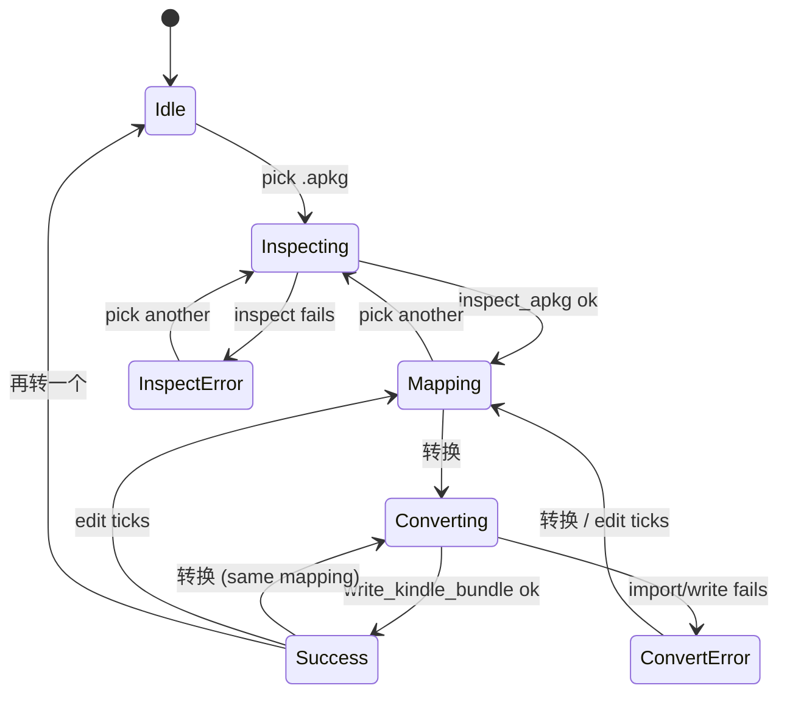
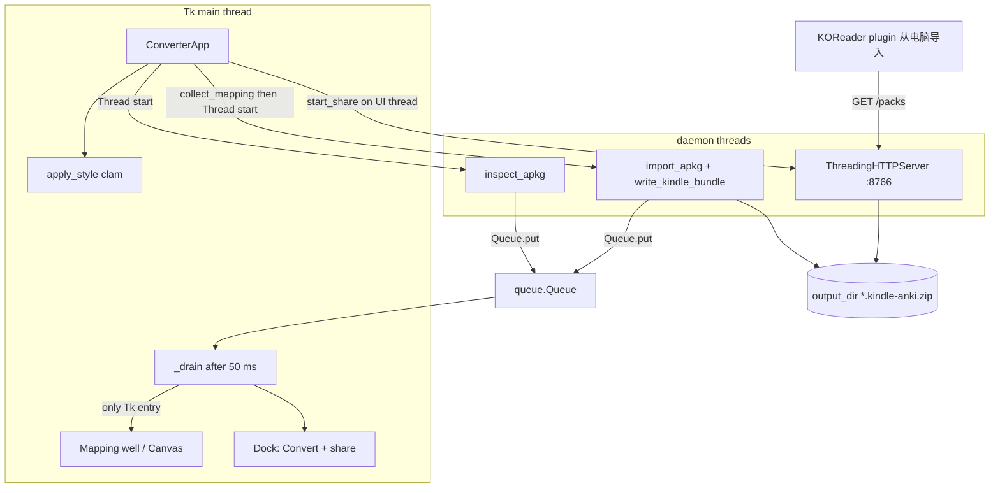

<p align="right">
  <a href="converter-ui-redesign.zh_CN.md">简体中文</a> · <strong>English</strong>
</p>

# Kindle Anki Import — Desktop Window Redesign

| Field | Value |
| --- | --- |
| Title | Redraw the macOS converter window |
| Author | TBD |
| Date | 2026-09-13 |
| Status | Implemented (2026-09). Landing deltas: added COPY keys `pack_name` / `pack_name_hint` and helper `initial_pack_name` for the pack-name field. |
| Product | `dist/Kindle Anki Import.app` (PyInstaller windowed universal2) |
| Live code | `tools/kindle_import_app.py` (`ConverterApp`) |
| Audience | Engineer implementing the Tkinter/ttk restyle |

---

## Overview

The shipped converter is a working local pipeline: pick an `.apkg`, tick per-note-type front/back fields, write `*.kindle-anki.zip` on disk, and keep a LAN server on `:8766` so the KOReader plugin can import over home Wi-Fi. The window that hosts this pipeline (`ConverterApp` in `tools/kindle_import_app.py`) is a default ttk form. There is no step hierarchy, the mapping canvas and scrollbar are packed as siblings on the root, Convert runs on the UI thread and freezes the window, and the Wi-Fi IP is a wrapped label that is easy to miss after a modal “转换完成”.

This design redraws the **single macOS window** as a paper-like e-ink study tool: three bands (masthead + source, mapping well, convert/share dock), a clam ttk theme with six named surface colors, Chinese copy that is directional rather than decorative, and inspect/convert work moved onto a daemon thread that only `Queue.put`s results. The Tk main thread is the only caller of `after()`, widgets, and `StringVar`, via a 50 ms drain loop. Pack format, mapping semantics, the unauthenticated home-Wi-Fi model, and the “no API key in the converter” rule do not change. The local web UI in `tools/kindle_import_server.py` is **out of P0**.

**Source of truth for widgets, copy, and layout:** tokens + ASCII wireframes + the dock state table in this document. Mockups are mood only (see Mockups → Do not implement).

---

## Background & Motivation

### Current state (verified in code)

`ConverterApp` (`tools/kindle_import_app.py`) is a `tk.Tk` of `720x640` titled `Kindle Anki 转换`. `_build()` stacks, in order:

1. A hint label: `把 Anki .apkg 转成 Kindle 插件用的卡包（本机转换，不上传）。`
2. Pick-apkg row (`选择 Anki 卡包…` + `apkg_var`).
3. Pick-output row (`保存到…` + `out_var`, default `Path.home() / "Desktop"`).
4. Mapping hint + `tk.Canvas(height=280)` and a `ttk.Scrollbar` packed on **`self`**, not in a shared host.
5. `转换` / `打开保存文件夹` / `使用说明`.
6. `share_var` (wraplength 680) and `status` (wraplength 680).

`render_mapping()` builds a `ttk.LabelFrame` per note type, two `pack(side="left")` columns of `ttk.Checkbutton`s whose labels are `"{name}  （例如 {sample[:24]})"`, pre-ticked from `inspect_apkg(...).suggested_front/back`. Every field name appears in **both** columns.

`convert()` is:

```158:172:tools/kindle_import_app.py
    def convert(self) -> None:
        if not self.apkg_path:
            messagebox.showinfo("转换", "请先选择 .apkg。")
            return
        self.status.set("转换中…")
        self.update_idletasks()
        try:
            package = import_apkg(self.apkg_path, None, self.collect_mapping())
            result = write_kindle_bundle(package, self.apkg_path, self.output_dir)
        except Exception as exc:  # noqa: BLE001
            self.status.set("转换失败。")
            messagebox.showerror("转换失败", f"{exc}\n\n{traceback.format_exc()}")
            return
```

`start_share()` binds `ThreadingHTTPServer(("0.0.0.0", 8766))` on launch (`PACK_PORT` in `tools/kindle_pack_server.py`) and serves `*.kindle-anki.zip` with no auth. Later calls (from `pick_output` and `convert`) either update `pack_holder["root"]` or **retry** `start_pack_server` if the launch bind failed (`pack_holder is None`). There is no API-key widget; `import_apkg(..., None, mapping)` never writes keys, and `save_package` strips `ai.api_key`.

Importer mapping fallback (must not change): `_models()` in `tools/kindle_anki_importer.py` applies a per-model mapping only when `mapped_front` is non-empty (`if mapped_front:` around line 240). An empty `front: []` means “ignore this model’s ticks and keep auto-detect,” including ignoring that model’s `back` ticks. Unchecking every front box today still converts with suggested mapping.

### Pain

| Symptom | Cause in current code |
| --- | --- |
| Looks like a stock ttk form | Default theme, equal padding, `LabelFrame`s, no type scale |
| Mapping fights the scrollbar | `canvas.pack(...)` then `scroll.pack(side="right")` on the root; inner window is not stretched to canvas width; no mousewheel |
| Share IP is easy to miss | Wrapped label + blocking `messagebox.showinfo` after convert |
| Convert freezes the window | `import_apkg` + `write_kindle_bundle` on the Tk thread; `update_idletasks()` only paints “转换中…” once |
| Empty / progress / error are not composed | Empty mapping is a blank canvas; errors are modal tracebacks; success is a dialog that hides the IP |

The `.app` is the product (`desktop/Kindle-Anki-Import.command` execs it when present). Users must keep the window open for Wi-Fi import. The UI has to make that fact obvious.

---

## Goals & Non-Goals

### Goals

- Give the single window a distinctive, implementable visual system that ttk can actually render (clam theme, system fonts, hairlines, one cinnabar control).
- Make the flow readable as three bands: source, mapping, convert + Wi-Fi share.
- Keep per-note-type front/back checkboxes; fix scrolling, hierarchy, long names, and suggested defaults.
- Promote LAN share (IP, port 8766, “窗口不要关”) to a first-class dock region.
- Stop freezing the window: daemon worker + UI-thread `Queue` drain (`after(50, …)` scheduled only on the Tk thread).
- Chinese empty / inspecting / converting / success / error copy.
- Keyboard and contrast that work on an e-ink-inspired light palette.
- Specify tests that do not invent a browser harness, and a manual `.app` checklist.
- Specify PyInstaller datas (none for fonts) and that `.app` rebuild is rollout, not GitHub publish.

### Non-goals

- Electron, SwiftUI, webview, CustomTkinter, or a browser UI as the P0 path.
- Any change to pack JSON, zip layout, `inspect_apkg` / `import_apkg` mapping semantics, or the Kindle plugin.
- Adding pack API-key / endpoint / model inputs to the `.app`.
- Authenticating `:8766` or binding it to localhost.
- Requiring a developer Python for the `.app` path.
- Restyling `tools/kindle_import_server.py` (see Key Decision K4).
- Dark mode, bundled webfonts, or a new `.icns` in P0.
- Publishing GitHub Releases.

---

## Key Decisions

| ID | Decision | Why |
| --- | --- | --- |
| K1 | Stay Tkinter/ttk inside the existing `.app`. Force `clam`, not macOS `aqua`. | Aqua ignores `TButton` background. The shipped binary already bundles Tcl/Tk 9 (`libtcl9tk9.0.dylib`), so clam is available and looks the same on Intel and Apple Silicon. |
| K2 | One window, three bands. Not a wizard. | Share must stay visible the whole time the process lives. A wizard would hide the IP during mapping. |
| K3 | Dock boldness is split by channel, not by screen. **Color:** enabled `转换` is the only cinnabar object (`Seal.TButton`). **Type:** LAN IPv4 is Menlo 22 in every state where share is bound. Disabled Convert is outline `TButton` (`rule` border, `ink` text), never a grey-red chip. Share tick is `ink` always. After success the primary stays labeled `转换` (enabled while mapping exists); `再转一个` is a quiet secondary that only resets the well. | Spend cinnabar once. Share is first-class from launch via type scale, not a post-success surprise. Idle must not show a disabled red button next to a huge IP. |
| K4 | P0 is `kindle_import_app.py` (+ a small `kindle_import_ui.py` helper). Leave `kindle_import_server.py` HTML alone. | The `.app` is the product. The web UI is a developer fallback and still contains API endpoint/model fields we refuse to put in the `.app`. |
| K5 | Inspect and convert run on a daemon thread. The worker only `Queue.put`s callables (or result tuples). The Tk thread is the only caller of `after()`, widgets, and `StringVar`, via `after(50, self._drain)` started from `__init__`. Each drain job is wrapped in `try/except`; the loop always reschedules when `_alive`. On `WM_DELETE_WINDOW`, set `_alive = False`, `_unbind_wheel()`, `after_cancel` the drain, ignore the queue, then `destroy()`. | `self.after(...)` from a daemon thread is still `tk.call` into Cocoa Tk 9 and can crash. A job exception must not kill the drain. Close-box during convert must not run jobs on a destroyed interpreter. |
| K6 | Replace the success `messagebox` with the dock. Keep modal dialogs only for “this needs an acknowledgement” if inline copy is insufficient; default is inline. | The modal is what hides the IP. |
| K7 | No API-key widget. Pass `ai=None` to `import_apkg` as today. | Product rule; `save_package` already strips keys. |
| K8 | System fonts only. `ui_font` / `ip_font` query `tkfont.families()` after `tk.Tk()` exists and return a single `(family, size)` or `(family, size, "bold")`. No CSS-style family tuples, no `"medium"`. No font files in PyInstaller `datas`. | Tk font tuples are not family stacks. PingFang SC is on macOS 11+. |
| K9 | Force a light paper palette. Do not follow macOS dark mode. | The subject is e-ink. Dark ttk would be a second theme we will not maintain. |
| K10 | Mapping widgets stay checkboxes with the same `suggested_front` / `suggested_back` defaults. Sample text moves off the checkbox onto a mute second-line `Well.TLabel`. Convert stays clickable (`Seal.TButton`) whenever mapping exists; `convert()` refuses unless **every shown model** has at least one front tick (`每个笔记类型至少勾一个正面字段。`). No `BooleanVar` traces. Importer `if mapped_front:` fallback is unchanged and locked by a test. | Empty `front: []` currently means auto-detect, not “no front.” Disabling the button would hide `need_front` / checklist 7. |
| K11 | Rebuild the universal2 `.app` after the UI lands. Do not git push or publish. | Packaging is rollout; GitHub is gated. |
| K12 | Windows `.bat` / Linux Tk keep working on the same file, but visual QA is macOS 11+ `.app` only. Mousewheel math is normalized for macOS, Windows (±120), and X11 Button-4/5. `bind_all` lasts for the window life; do not use well `<Enter>`/`<Leave>` to unbind. | P0 surface is the shipped Mac window; the same `.py` must not jump 120 units per notch on Windows, and must still scroll when the pointer is on a checkbox. |

---

## Proposed Design

### Visual identity

**Name:** 校对台 (proof desk). The window is a Kindle bezel around an e-ink page: cooler than cream, quieter than a settings form, one vermilion control like a scholar’s seal on a proof.

Grounded in the subject (paperwhite screen, graphite type, annotation), not in a SaaS dashboard. Not cream+terracotta. Not acid-green dark. Not a stack of identical rounded cards. No ALL-CAPS eyebrows. No middle-dot meta strings used as decoration (`Basic · 3 fields` is forbidden as ornament; note-type kind sits in mute type on the same line as the name, with a space, not a decorative `·`).

### Tokens (ttk-real)

Named surface colors, six:

| Token | Hex | Role |
| --- | --- | --- |
| `paper` | `#E8E6DF` | Window / bezel background |
| `well` | `#F3F2EC` | Mapping “screen” |
| `ink` | `#1A1916` | Primary text; share tick |
| `mute` | `#4A4944` | Secondary text (11px still ≥ 7:1 on `well`) |
| `rule` | `#B8B6AE` | Hairlines, disabled fill |
| `seal` | `#8C2A1E` | **Enabled** `转换` button fill only |

Seal interaction (darkenings of `seal`, not a second accent):

| Token | Hex | Role |
| --- | --- | --- |
| `seal_pressed` | `#6F1F16` | `Seal.TButton` pressed |
| `seal_active` | `#A33325` | `Seal.TButton` active |

Checkbox tick uses `ink` on `well`, not `seal`. Share “on” tick is an 8 px `ink` square, never `seal`.

**Type** (macOS, no bundled files). Families are chosen at runtime; see `ui_font` / `ip_font`. Preferred names:

| Role | Preferred family | Size | Weight | Use |
| --- | --- | --- | --- | --- |
| Title | PingFang SC | 20 | `normal` | Masthead `Kindle Anki 转换` |
| Body | PingFang SC | 13 | `normal` | Field names, status, outline buttons |
| Mute | PingFang SC | 11 | `normal` | Tagline, samples, port, kind |
| IP | Menlo | 22 | `normal` | LAN IPv4 in the dock, **every** bound state |
| Button | PingFang SC | 14 | `bold` | Enabled `转换` only (`"bold"`, never `"medium"`) |

`ui_font` / `ip_font` implementation (call only after `tk.Tk()` exists):

```python
import tkinter.font as tkfont

_UI_FAMILIES = ("PingFang SC", "Hiragino Sans GB", ".AppleSystemUIFont")
_IP_FAMILIES = ("Menlo", "Courier")

def choose_family(available: set[str], candidates: tuple[str, ...], fallback: str) -> str:
    for name in candidates:
        if name in available:
            return name
    return fallback

def ui_font(root: tk.Misc, size: int, *, bold: bool = False) -> tuple:
    available = set(tkfont.families(root))
    fallback = tkfont.nametofont("TkDefaultFont").actual("family")
    name = choose_family(available, _UI_FAMILIES, fallback)
    return (name, size, "bold") if bold else (name, size)

def ip_font(root: tk.Misc, size: int = 22) -> tuple:
    available = set(tkfont.families(root))
    name = choose_family(available, _IP_FAMILIES, "Courier")
    return (name, size)
```

Unit-test `choose_family` with a fake `available` set, not live Tk. `option_add` needs a Tcl font string, e.g. `root.option_add("*Font", "{%s} %d" % (ui_font(root, 13)[0], 13))`. Do **not** pass `("PingFang SC", "Hiragino Sans GB", …)` into `style.configure` — Tk treats the second element as a size.

**Spacing / density** (pixels at 1×; Tk 9 is retina-capable via `NSHighResolutionCapable`):

| Token | Value |
| --- | --- |
| Window default | `760x680` |
| `minsize` | `700x600` (still usable at ~720 wide) |
| Outer pad | 20 |
| Band gap | 0 (hairline, not whitespace cards) |
| Inner pad | 16 |
| Row gap | 8 |
| Checkbox row | 4 vertical |
| Hairline | 1 px `rule` |
| Button pad | 16×8 (`seal`), 12×6 (secondary) |

**Radius:** 0 in the design language. clam buttons have a slight native chamfer we do not try to CSS away. Do not draw rounded `Canvas` “cards”.

**Principles**

1. Bezel around a page, not a column of cards.
2. One cinnabar object: enabled `转换`. Share tick is `ink`. IP is Menlo 22 in every bound state.
3. Empty and error states tell the user what to do next.
4. Chinese strings in the live UI; this document quotes them verbatim.
5. Widgets, copy, and layout come from tokens + ASCII + the dock state table. Mockups are mood.

### ttk.Style map (implementable)

Call this **after** `tk.Tk()` exists and **before** building widgets. Put the dicts in `tools/kindle_import_ui.py`. Do **not** `style.configure(".", borderwidth=0)` — that leaks into children. Set `borderwidth` per class.

Bundled `clamTheme.tcl` configures `TButton` with `-width -11`, `-relief raised`, and maps `-background` / `-lightcolor` / `-darkcolor` for pressed/active/disabled. `Seal.TButton` must override **all** of those or the fill will bevel with theme greys and `转换` will be an 11-character-wide chip.

```python
COLORS = {
    "paper": "#E8E6DF",
    "well": "#F3F2EC",
    "ink": "#1A1916",
    "mute": "#4A4944",
    "rule": "#B8B6AE",
    "seal": "#8C2A1E",
    "seal_pressed": "#6F1F16",
    "seal_active": "#A33325",
}

def apply_style(root: tk.Tk) -> ttk.Style:
    style = ttk.Style(root)
    style.theme_use("clam")
    root.configure(bg=COLORS["paper"])
    body = ui_font(root, 13)
    root.option_add("*Font", "{%s} %d" % (body[0], body[1]))
    style.configure(".", background=COLORS["paper"], foreground=COLORS["ink"],
                    font=body)
    style.configure("TFrame", background=COLORS["paper"])
    style.configure("Well.TFrame", background=COLORS["well"])
    style.configure("TLabel", background=COLORS["paper"], foreground=COLORS["ink"])
    style.configure("Well.TLabel", background=COLORS["well"], foreground=COLORS["ink"])
    style.configure("Mute.TLabel", foreground=COLORS["mute"], font=ui_font(root, 11))
    style.configure("WellMute.TLabel", background=COLORS["well"],
                    foreground=COLORS["mute"], font=ui_font(root, 11))
    style.configure("Title.TLabel", font=ui_font(root, 20))
    style.configure("IP.TLabel", font=ip_font(root, 22), background=COLORS["paper"])
    style.configure(
        "TButton",
        padding=(12, 6),
        background=COLORS["paper"],
        foreground=COLORS["ink"],
        bordercolor=COLORS["rule"],
        lightcolor=COLORS["paper"],
        darkcolor=COLORS["paper"],
        relief="solid",
        borderwidth=1,
        width=0,
        focusthickness=2,
        font=body,
    )
    style.map(
        "TButton",
        background=[("disabled", COLORS["paper"]), ("pressed", COLORS["rule"]),
                    ("active", COLORS["well"])],
        foreground=[("disabled", COLORS["mute"])],
        lightcolor=[("disabled", COLORS["paper"]), ("pressed", COLORS["rule"])],
        darkcolor=[("disabled", COLORS["paper"]), ("pressed", COLORS["rule"])],
    )
    style.configure(
        "Seal.TButton",
        background=COLORS["seal"],
        foreground=COLORS["well"],
        bordercolor=COLORS["seal"],
        lightcolor=COLORS["seal"],
        darkcolor=COLORS["seal"],
        padding=(16, 8),
        relief="solid",
        borderwidth=1,
        width=0,
        focusthickness=2,
        font=ui_font(root, 14, bold=True),
    )
    style.map(
        "Seal.TButton",
        background=[
            ("disabled", COLORS["rule"]),
            ("pressed", COLORS["seal_pressed"]),
            ("active", COLORS["seal_active"]),
        ],
        foreground=[
            ("disabled", COLORS["ink"]),
            ("pressed", COLORS["well"]),
            ("active", COLORS["well"]),
        ],
        bordercolor=[
            ("disabled", COLORS["rule"]),
            ("pressed", COLORS["seal_pressed"]),
            ("active", COLORS["seal_active"]),
        ],
        lightcolor=[
            ("disabled", COLORS["rule"]),
            ("pressed", COLORS["seal_pressed"]),
            ("active", COLORS["seal_active"]),
        ],
        darkcolor=[
            ("disabled", COLORS["rule"]),
            ("pressed", COLORS["seal_pressed"]),
            ("active", COLORS["seal_active"]),
        ],
    )
    style.configure("TCheckbutton", background=COLORS["well"], foreground=COLORS["ink"],
                    indicatorbackground=COLORS["well"], indicatorforeground=COLORS["ink"])
    style.configure("Vertical.TScrollbar", background=COLORS["paper"],
                    troughcolor=COLORS["well"], bordercolor=COLORS["paper"])
    style.configure("Horizontal.TProgressbar", troughcolor=COLORS["rule"],
                    background=COLORS["ink"], bordercolor=COLORS["paper"],
                    lightcolor=COLORS["ink"], darkcolor=COLORS["ink"])
    return style
```

Disabled `Seal.TButton` is `rule` fill + **`ink` text** (~7:1), not `well` text (~1.8:1). Idle Convert does not use `Seal.TButton` at all (see dock table). `width=0` cancels clam’s `-width -11`.

Hairlines are `tk.Frame(..., height=1, bg=COLORS["rule"], highlightthickness=0)`, not ttk separators (clam separators are chunky).

Clam’s indeterminate `Horizontal.TProgressbar` is a **sliding block**, not a hatch and not a 4 px CSS bar. Accept that look. Do not paint a custom hatch on the Canvas.

### Information architecture

Single window, three bands, always on screen. Geometry manager: **`grid` on `ConverterApp`**. Masthead row 0, source row 1, well row 2 (`weight=1`, the only expanding band), dock row 3. Column 0 `weight=1`. Outer padx/pady 20 on each band. Dock does not scroll off screen.

```
┌ masthead (title + tagline) ───────────────────────── 使用说明 ┐
│ source strip (apkg + output)  Button + Label, not Entry        │
├ hairline ────────────────────────────────────────────────────┤
│ mapping well  (empty | inspecting | fields | error)   ▮ scroll│
├ hairline ────────────────────────────────────────────────────┤
│ dock left: 转换 [+ 再转一个] + status  │  share ≥260 px (IP)  │
└──────────────────────────────────────────────────────────────┘
```

`使用说明` lives in the masthead (quiet `TButton`) in **every** state. It is not a dock button. `打开保存文件夹` stays in the dock because it is part of the convert result.

State machine (share is orthogonal: `Bound` / `BindError` / `Loopback`):



`再转一个` is the only path that clears `apkg_path` / mapping. Success still has `转换` enabled.

### ASCII wireframes

These, plus the dock state table, are what to implement.

**Idle** (no apkg). `转换` is a disabled outline `TButton`, not cinnabar. Source path is a `Label`, not an `Entry`. Help is in the masthead. IP is Menlo 22, IPv4 only (no `:8766` glued on). Tick is ink.

```
+------------------------------------------------------------------+
| o o o                                              Kindle Anki 转换 |
+------------------------------------------------------------------+
| Kindle Anki 转换                                      使用说明     |
| 把 Anki 卡包转成本机文件，不上传。                                 |
|                                                                  |
| [ 选择 Anki 卡包… ]  未选择 .apkg                                  |
| [ 保存到… ]          ~/Desktop                                   |
|------------------------------------------------------------------|
|                                                                  |
|                     还没有卡包。                                  |
|     选一个 Anki 导出的 .apkg，正面和背面字段会列在这里。            |
|                                                                  |
|------------------------------------------------------------------|
| [转换]  [打开保存文件夹]           无线导入已开                    |
|  选择 .apkg 后会列出字段。         192.168.1.10                    |
|  (disabled outline, ink on paper)  端口 8766。窗口不要关。         |
|                                    [复制 IP]                      |
+------------------------------------------------------------------+
```

**Mapping.** Every field is listed in **both** columns (same as live `render_mapping()`). No nested Options/Answer-only rows. Help still masthead. Convert is enabled `Seal.TButton`.

```
+------------------------------------------------------------------+
| Kindle Anki 转换                                      使用说明     |
| 把 Anki 卡包转成本机文件，不上传。                                 |
| [ 选择 Anki 卡包… ]  驾照题库.apkg                                 |
| [ 保存到… ]          ~/Desktop                                    |
| 背面不要勾题目，翻面就不会再看到正面。  已按笔记类型预勾，可改。     |
|------------------------------------------------------------------|
| Basic  简答                                                     ▮|
| 正面                          背面                                |
| [x] Front                     [ ] Front                           |
|     例如 2 + 2                    [x] Back                        |
|                                      例如 4                       |
| Single Choice  选择                                               |
| [x] Question                  [ ] Question                        |
|     例如 Which letter…            [ ] Option A                    |
| [ ] Option A                      [ ] Option B                    |
| [ ] Option B                      [x] Explanation                 |
| [x] Explanation                      例如 F is sixth              |
|------------------------------------------------------------------|
| [转换]  [打开保存文件夹]           无线导入已开                    |
|  已列出字段。勾选正面和背面后点转换。  192.168.1.10                |
|                                    端口 8766。窗口不要关。         |
+------------------------------------------------------------------+
```

**Converting.** Mapping widgets `state=["disabled"]` (ttk cannot fade a Frame; no grey Canvas overlay). Help in masthead. Convert is disabled outline labeled `转换中`. Progress is clam’s sliding indeterminate block in the dock, not a hatch.

```
+------------------------------------------------------------------+
| Kindle Anki 转换                                      使用说明     |
| [ 选择 Anki 卡包… ]  驾照题库.apkg     (disabled)                 |
|------------------------------------------------------------------|
| mapping checkboxes state=disabled, well bg still #F3F2EC          |
|------------------------------------------------------------------|
| [==== sliding block ====]                                        |
| [转换中]  [打开保存文件夹]         无线导入已开                    |
| 正在转换 驾照题库.apkg，窗口可拖，不要关。  192.168.5.35           |
+------------------------------------------------------------------+
```

Window remains draggable. Close box still works (`WM_DELETE_WINDOW` stops the drain; daemon workers are abandoned).

**Success + Wi-Fi.** Mapping still visible and editable (not “quieter” via a fade). Primary is still `转换` (Seal, enabled). `再转一个` is a quiet outline secondary. Help still masthead. IP still IPv4 only; port on its own line.

```
+------------------------------------------------------------------+
| Kindle Anki 转换                                      使用说明     |
| mapping well still showing ticks (editable)                       |
|------------------------------------------------------------------|
| [转换]  [再转一个]  [打开保存文件夹]   Kindle 填这个 IP            |
| 完成，128 张卡片。                   192.168.5.35     [复制 IP]   |
| 已写入 驾照题库.kindle-anki.zip      端口 8766。工具 → Kindle Anki │
|                                      → 从电脑导入。窗口不要关。    |
|                                      无线导入已开                  |
+------------------------------------------------------------------+
```

`完成，{n} 张卡片` uses `n = len(package.get("cards", []))`, the imported card list, same as today’s convert status. Not `report.total_cards`.

**Inspect error** (inline in the well, two COPY keys):

```
| 打不开这个文件。                                                  |
| 确认是 Anki 导出的 .apkg，不是 .colpkg，也不是只用新格式的备份。   |
| [选择 Anki 卡包…]                                                |
```

**Convert error** (dock; mapping remains):

```
| 转换失败。卡包没改动。                                            |
| <AnkiImportError message, one line, mute>                         |
| [复制错误详情]  [转换]                                            |
```

**Share bind `OSError`** (right dock; no Kindle-facing IP, no “已开”):

```
| 无法开启无线导入：{err}                                           |
```

**Share bound, `lan_ip()` is loopback** (server is up; Kindle cannot use it):

```
| 127.0.0.1                                                         |
| 没有可用的局域网 IP。Kindle 到不了这台电脑。                       |
| 检查 Wi-Fi，或允许传入连接。                                       |
```

### Mockups

Mood only. **Widgets, copy, and layout come from tokens + ASCII + the dock state table.** If a mockup disagrees, ignore the mockup.

Idle:


- Session: `images/1.jpg`

Mapping:


- Session: `images/4.jpg`

Converting:


- Session: `images/5.jpg`

Success / Wi-Fi share:


- Session: `images/6.jpg`

**Do not implement from the mockups:**

| Mockup artifact | Implement instead |
| --- | --- |
| `使用说明` as a third dock button (idle/mapping/converting) | Masthead, every state |
| Idle Convert as a live cinnabar chip | Disabled outline `TButton` |
| `192.168.5.35:8766` concatenation | IPv4 in Menlo 22; `share_keep_line(port)` under it. `复制 IP` copies IPv4 only |
| Nested Options/Answer rows / “A. 正确答案” on the back column only | Every field in both columns |
| Idle output path as an editable `Entry` with caret | `Button` + `Label` as today |
| Grey Canvas overlay while converting | `state=["disabled"]` on mapping widgets; well stays `well` |
| Enabled-looking seal `转换中` | Disabled outline labeled `转换中` |
| Italic / display-face “完成，128 张卡片” | PingFang SC 13/20 via `ui_font` |
| Hatched progress scribble | clam indeterminate sliding block |
| Success primary `再转一个` replacing Convert | Primary stays `转换`; `再转一个` is secondary |
| Physical Kindle-bezel device chrome | macOS window, paper interior |

### Architecture



```mermaid
sequenceDiagram
    actor User
    participant UI as ConverterApp UI thread
    participant Q as queue.Queue
    participant W as Worker thread
    participant Importer as inspect_apkg / import_apkg
    participant Share as pack server :8766
    User->>UI: launch
    UI->>UI: after 50 drain loop; protocol WM_DELETE_WINDOW
    UI->>Share: start_share output_dir
    Share-->>UI: bound or OSError
    UI->>UI: dock share region
    User->>UI: 选择 Anki 卡包…
    UI->>W: path only
    W->>Importer: inspect_apkg path
    Importer-->>W: models, suggested_*, sample
    W->>Q: put on_inspect_ok
    Q->>UI: drain calls render_mapping
    User->>UI: 转换
    UI->>UI: mapping = collect_mapping on UI thread
    UI->>W: apkg, outdir, mapping
    W->>Importer: import_apkg None mapping
    W->>Importer: write_kindle_bundle
    Importer-->>W: zip + cards
    W->>Q: put on_convert_ok
    Q->>UI: drain calls show_success
    UI->>Share: start_share retry or holder root
    User->>Share: Kindle GET /packs
```

### Mapping UI

Keep the data model:

```python
self.field_vars: dict[str, dict[str, list[tk.BooleanVar]]]
# collect_mapping() -> {model_id: {"front": [int], "back": [int]}}
```

`inspect_apkg` already returns `id`, `name`, `fields`, `kind` (`short_answer` | `choice` | `unknown`), `suggested_front`, `suggested_back`, `sample`, plus `unsupported_models`. The live app ignores `kind` and `unsupported_models`. Surface them quietly; do not change suggestion logic.

**Layout per note type** — not `ttk.LabelFrame`:

```
name   kind_label          ← Well.TLabel + WellMute.TLabel, then 1px rule
正面                       背面
[cb] name_label            [cb] name_label
     mute sample                mute sample
```

Use `grid` with `columnconfigure(0, weight=1)` and `columnconfigure(1, weight=1)`. Two columns stay side by side down to 700 px.

**Widget tree per field** (P0; no ellipsis, no `Toplevel` tooltip):

- `ttk.Checkbutton` with **empty text** (indicator only), `takefocus=1`.
- Adjacent `Well.TLabel` for the field name. `wraplength` from the column’s `<Configure>` (`width − 28`). Cap at two visual lines by slicing the string to what fits in `2 * wraplength` via `tkfont.Font.measure` if needed; otherwise let ttk wrap. Full name stays in the label (wrap is enough).
- Click on the name label toggles the same `BooleanVar` (`label.bind("<Button-1>", …)`).
- Sample is a second-line `WellMute.TLabel` from `field_sample_text`.

Do not put the field name in `Checkbutton["text"]` and then also set `wraplength` on that checkbutton.

```python
def field_name_text(name: str, index: int) -> str:
    text = (name or "").strip()
    if text:
        return text
    return COPY["field_unnamed"].format(n=index + 1)

def field_sample_text(raw: str, limit: int = 24) -> str:
    text = " ".join(str(raw).split())
    if len(text) > limit:
        text = text[:limit].rstrip()
    return COPY["sample"].format(text=text) if text else ""
```

**Suggested defaults:** `BooleanVar(value=index in suggested_{side})` as today. Mute hint in the source band: `已按笔记类型预勾，可改。`

**Kind labels** (mute, not badges) for models that **appear** in the well (`inspect["models"]`):

| `kind` | Copy |
| --- | --- |
| `short_answer` | `简答` |
| `choice` | `选择` |
| `unknown` | `未识别，按简答导入` |

`unsupported_models` are names `_models()` skipped; they are **not** shown as checkboxes and are **not** imported as short-answer. If that list is non-empty, one mute line under the last shown type: `有 {n} 种笔记类型无法识别。` with `n = len(inspect["unsupported_models"])`. Do not say `已按简答处理`.

**Scrolling — replace the current pack bug.** Host canvas + scrollbar in one `Well.TFrame` using `grid`. Stretch the inner window to canvas width. Canvas constructor **must** be `tk.Canvas(..., bg=COLORS["well"], highlightthickness=0, bd=0)` — default Canvas is system white.

Mousewheel: named methods, normalized steps, no stacked `add="+"` handlers. **Do not bind `<Enter>` / `<Leave>` on the well.** Tk fires `<Leave>` on a parent when the pointer enters a child. The well’s pixels are almost entirely children (canvas, `create_window` host, checkbuttons, name labels), so Leave-to-unbind would drop scrolling the moment the user hovers a field — the actual scroll target.

Bind `bind_all` for the **life of the window**. `_unbind_wheel` only around `filedialog` / `messagebox` and in `_on_close`. Scrolling the mapping canvas while the pointer is over the dock, masthead, or a checkbox is acceptable. After a dialog returns, call `_bind_wheel` again (unconditional; do not wait for the pointer to re-enter the well).

```python
def wheel_steps(event: tk.Event) -> int:
    num = getattr(event, "num", None)
    if num == 4:
        return -1
    if num == 5:
        return 1
    delta = int(getattr(event, "delta", 0) or 0)
    if abs(delta) >= 120:          # Windows Tk
        return -delta // 120
    return -int(delta or 0)        # macOS Tk ±1 / ±N

def _on_well_wheel(self, event: tk.Event) -> str:
    steps = wheel_steps(event)
    if steps:
        self._canvas.yview_scroll(steps, "units")
    return "break"

def _bind_wheel(self) -> None:
    self._canvas.bind_all("<MouseWheel>", self._on_well_wheel)
    self._canvas.bind_all("<Button-4>", self._on_well_wheel)
    self._canvas.bind_all("<Button-5>", self._on_well_wheel)

def _unbind_wheel(self) -> None:
    self._canvas.unbind_all("<MouseWheel>")
    self._canvas.unbind_all("<Button-4>")
    self._canvas.unbind_all("<Button-5>")
```

`__init__` (after the canvas exists) calls `_bind_wheel`. `_on_close` calls `_unbind_wheel` before `destroy()`. Before every `filedialog` / `messagebox`: `_unbind_wheel()`; `try: dialog(); finally: self._bind_wheel()` if `self._alive`.

**Validation (UI only; importer unchanged):** Convert is **clickable** (`Seal.TButton`) whenever mapping widgets exist and the app is not busy — including after success, and including when some fronts are empty. There are **no** `BooleanVar` traces to disable the button. `convert()` and ⌘Return still **refuse to start a worker** unless every shown model has a non-empty `front` list; they set the dock status to `每个笔记类型至少勾一个正面字段。` and return. Back may be empty. This closes the footgun where clearing type A’s fronts would send `front: []` and `_models` would silently restore auto-detect (and ignore that type’s back ticks), while still matching checklist item 7 (user can click Convert and see the copy).

```python
def mapping_fronts_complete(mapping: dict) -> bool:
    if not mapping:
        return False
    return all(bool((sides or {}).get("front")) for sides in mapping.values())
```

Lock importer behavior in `tests/test_kindle_cards.py` so PR4 cannot “fix” it by changing `_models`:

```python
def test_empty_front_mapping_keeps_autodetect(self) -> None:
    # field_mapping front: [] is ignored; Basic stays Front/Back autodetect.
    ...
    package = import_apkg(apkg, field_mapping={"1": {"front": [], "back": [1]}})
    basic = next(card for card in package["cards"] if card["front"] == "2 + 2")
    self.assertEqual(basic["back"], "4")  # auto Back, not the ignored spec
```

Initialize `self.field_vars = {}` in `__init__` so a stray Convert cannot `AttributeError`.

### Dock: primary action, status, LAN share

The dock is a 2-column `ttk.Frame` that does not scroll. Freeze these **slots** in PR3 even if success copy is still the old sentence: left actions, right share ≥ 260 px, Help already in the masthead.

**Left: actions + status**

| State | Primary | Secondary | Status |
| --- | --- | --- | --- |
| Idle | `转换` disabled, style `TButton` (outline) | `打开保存文件夹` | `选择 .apkg 后会列出字段。` |
| Inspecting | `转换` disabled `TButton` | same | `正在读取字段…` |
| Mapping | `转换` enabled, style `Seal.TButton` | same | `已列出字段。勾选正面和背面后点转换。` |
| Converting | `转换中` disabled `TButton` + clam indeterminate bar | same, disabled | `正在转换 {name}，窗口可拖，不要关。` |
| Success | `转换` enabled `Seal.TButton` | `再转一个` (outline) + `打开保存文件夹` | `完成，{n} 张卡片。` / `已写入 {zip.name}` |
| Convert error | `转换` enabled `Seal.TButton` | `复制错误详情` + `打开保存文件夹` | `转换失败。卡包没改动。` |

`再转一个` clears `apkg_path`, `inspect`, mapping widgets, returns the well to idle; **does not** stop the pack server or change `output_dir`. It is never the primary. Tweaking ticks after a successful write and clicking `转换` writes again.

Switch the primary widget’s style class when enabling/disabling: `Seal.TButton` only while enabled and labeled `转换` (mapping exists, not busy). Do not leave a disabled Seal chip in the idle dock. Incomplete fronts do **not** disable Convert; they fail inside `convert()` with `need_front`.

**Right: share (always allocated ≥ 260 px)**

Call `start_share()` on the **UI thread** from `__init__`, `pick_output`, and convert-success (drain callback). Implementation, same responsibilities as today:

1. If `self.pack_httpd is None`, try `start_pack_server(self.output_dir)` and start `serve_forever` on a daemon thread. On `OSError`, leave `pack_httpd is None` and show bind-error copy. Convert-success and `pick_output` **retry** this bind (port 8766 may have freed).
2. If the server is live, set `self.pack_holder["root"] = self.output_dir` (so changing the folder moves what Kindle lists). Do not `shutdown()`.
3. Then choose the dock variant from **bind result** and `lan_ip()`, which are independent:

| Condition | Headline | Numerals | Tick / “已开” | Copy IP |
| --- | --- | --- | --- | --- |
| `OSError` bind | `无法开启无线导入：{err}` | hidden | no | hidden |
| Bound, `is_lan_ip(lan_ip())` | `无线导入已开` | Menlo 22 IPv4 | 8 px **ink** square | copies IPv4 only |
| Bound, `lan_ip()` is `127.0.0.1` (or otherwise not LAN) | `没有可用的局域网 IP` | `127.0.0.1` | no “已开” | hidden or copies 127.0.0.1 with the warning still visible |

Do not treat loopback as a bind failure. `lan_ip()` falling back to `127.0.0.1` in `kindle_pack_server.py` can happen while the server **is** bound on `0.0.0.0`. Extra line in that case: `Kindle 到不了这台电脑。检查 Wi-Fi，或允许传入连接。`

On success (bound + LAN IP), add `Kindle 填这个 IP` above the numerals and `工具 → Kindle Anki → 从电脑导入。` before `share_keep_line(port)`.

Port + keep-open is one helper, so the `。` is not doubled or dropped:

```python
def share_keep_line(port: int) -> str:
    return COPY["share_keep_line"].format(port=port)
# COPY["share_keep_line"] = "端口 {port}。窗口不要关。"
```

`复制 IP` writes `lan_ip()` (IPv4 only, no port) via `self.clipboard_clear(); self.clipboard_append(ip); self.update_idletasks()`. Tk clipboard can vanish when the windowed `.app` loses focus; document “paste before closing the converter.” No `pbcopy` subprocess in P0. Status flash: `已复制 IP。`

`open_output` stays `webbrowser.open(path.as_uri())`. `open_guide` still opens `docs/USER_GUIDE.zh_CN.md` from `repo_root()` (PyInstaller already ships it under `datas`).

Progress bar: `ttk.Progressbar(..., mode="indeterminate", style="Horizontal.TProgressbar")`. `start(12)` on convert, `stop()` + `grid_remove()` otherwise. The importer has no percent callback; do not fake a determinate 0–100. Accept clam’s sliding block.

### Convert must not freeze the window

Rules:

1. Read every `BooleanVar` / path / widget on the UI thread **before** `Thread.start`.
2. Worker may call `inspect_apkg`, `import_apkg`, `write_kindle_bundle`, and compute plain Python values (dicts, strings, `Path`). It must not touch Tk objects, `StringVar`, widgets, or `self.after`.
3. Worker marshals with `self._ui_queue.put(callable)`. The callable runs only on the Tk thread inside `_drain`. Bind loop variables with default args (`lambda result=result: ...`) or put a tuple `("ok", package, result)` and dispatch in `_drain`.
4. `__init__` starts `self._drain_job = self.after(50, self._drain)` on the Tk thread and `_bind_wheel`. `_drain` processes the queue, **swallows per-job exceptions**, then always reschedules itself iff `self._alive`.
5. `self.protocol("WM_DELETE_WINDOW", self._on_close)`. `_on_close` sets `_alive = False`, `_unbind_wheel()`, `after_cancel(self._drain_job)`, ignores remaining jobs, then `destroy()`. Do not join workers.
6. Re-entry guard `self._busy`. Ignore Convert / pick while busy. File dialogs are not opened from the worker. Unbind mousewheel before dialogs; rebind in `finally` if `_alive`.
7. Exceptions: `traceback.format_exc()` in the worker, passed as a string; UI shows the exception message and keeps the traceback for `复制错误详情`.
8. `start_share()` stays on the UI thread (see dock). Convert-success drain callback calls it (retry bind and/or update `holder["root"]`). Convert must not `shutdown()` the HTTP server.

```python
def _drain(self) -> None:
    if not self._alive:
        return
    try:
        while True:
            job = self._ui_queue.get_nowait()
            if not self._alive:
                continue
            try:
                job()
            except Exception:
                self._last_traceback = traceback.format_exc()
                if self._alive:
                    self._set_status(COPY["drain_fail"])
    except queue.Empty:
        pass
    except Exception:
        self._last_traceback = traceback.format_exc()
    if self._alive:
        self._drain_job = self.after(50, self._drain)

def convert(self) -> None:
    if self._busy or not self._alive:
        return
    if not self.apkg_path:
        self._set_status(COPY["need_apkg"])
        return
    mapping = self.collect_mapping()
    if not mapping_fronts_complete(mapping):
        self._set_status(COPY["need_front"])
        return
    apkg, out = self.apkg_path, self.output_dir
    self._set_busy(True, label=COPY["converting"])
    threading.Thread(
        target=self._convert_worker, args=(apkg, out, mapping), daemon=True
    ).start()

def _convert_worker(self, apkg: Path, out: Path, mapping: dict) -> None:
    try:
        package = import_apkg(apkg, None, mapping)
        result = write_kindle_bundle(package, apkg, out)
    except Exception as exc:  # noqa: BLE001
        tb = traceback.format_exc()
        self._ui_queue.put(lambda exc=exc, tb=tb: self._on_convert_fail(exc, tb))
        return
    self._ui_queue.put(lambda: self._on_convert_ok(package, result))
```

Same queue pattern for `pick_apkg` → `_inspect_worker`. Drop the current `self.update_idletasks()` convert path. `_on_convert_ok` / `_on_convert_fail` start with `if not self._alive: return`.

`_set_busy(True)` sets mapping checkboxes `state=["disabled"]`, pick buttons, and the primary; starts the progress bar; keeps the title bar live. It does not draw an overlay.

### Chinese copy (verbatim)

All live strings live in `COPY` in `tools/kindle_import_ui.py`. Do not scatter literals in widget constructors. Helper formatters (`field_sample_text`, `field_name_text`, `share_keep_line`) read from `COPY`; they are not an exemption to invent Chinese.

```python
COPY = {
    "window_title": "Kindle Anki 转换",
    "title": "Kindle Anki 转换",
    "tagline": "把 Anki 卡包转成本机文件，不上传。",
    "pick_apkg": "选择 Anki 卡包…",
    "no_apkg": "未选择 .apkg",
    "pick_out": "保存到…",
    "convert": "转换",
    "converting": "转换中",
    "open_folder": "打开保存文件夹",
    "help": "使用说明",
    "copy_ip": "复制 IP",
    "again": "再转一个",
    "copy_error": "复制错误详情",
    "empty_title": "还没有卡包。",
    "empty_body": "选一个 Anki 导出的 .apkg，正面和背面字段会列在这里。",
    "map_hint": "背面不要勾题目，翻面就不会再看到正面。",
    "map_defaults": "已按笔记类型预勾，可改。",
    "front": "正面",
    "back": "背面",
    "kind_short": "简答",
    "kind_choice": "选择",
    "kind_unknown": "未识别，按简答导入",
    "unsupported": "有 {n} 种笔记类型无法识别。",
    "field_unnamed": "字段 {n}",
    "sample": "例如 {text}",
    "share_on": "无线导入已开",
    "share_ip_label": "Kindle 填这个 IP",
    "share_keep_line": "端口 {port}。窗口不要关。",
    "share_how": "工具 → Kindle Anki → 从电脑导入。",
    "share_loopback_title": "没有可用的局域网 IP",
    "share_loopback_body": "Kindle 到不了这台电脑。检查 Wi-Fi，或允许传入连接。",
    "status_idle": "选择 .apkg 后会列出字段。",
    "status_inspecting": "正在读取字段…",
    "status_mapped": "已列出字段。勾选正面和背面后点转换。",
    "status_converting": "正在转换 {name}，窗口可拖，不要关。",
    "status_done": "完成，{n} 张卡片。",
    "wrote": "已写入 {name}",
    "need_apkg": "请先选择 .apkg。",
    "need_front": "每个笔记类型至少勾一个正面字段。",
    "drain_fail": "界面更新失败。可复制错误详情。",
    "inspect_fail_title": "打不开这个文件。",
    "inspect_fail_body": "确认是 Anki 导出的 .apkg，不是 .colpkg，也不是只用新格式的备份。",
    "convert_fail": "转换失败。卡包没改动。",
    "share_fail": "无法开启无线导入：{err}",
    "ip_copied": "已复制 IP。",
    "file_dialog_apkg": "选择 Anki .apkg",
    "file_dialog_out": "选择保存位置",
}
```

Dialog titles for `filedialog` stay as above. Do not add English chrome. Exception text from `AnkiImportError` may be English (importer language); show it on the mute second line, keep the Chinese headline.

Removed keys vs the previous draft: `port` + `share_keep` (replaced by `share_keep_line`), single `inspect_fail` paragraph (split into title/body).

### Accessibility

- Tab order (explicit `takefocus`, not raw grid order): pick apkg → pick output → each checkbox (front column then back, per model) → Convert → `再转一个` if mapped → Open folder → Copy IP → Help (masthead).
- Space toggles the focused checkbox (ttk default). Return / ⌘Return call `convert()` when not busy and mapping widgets exist (same as clicking Seal `转换`). Incomplete fronts do not swallow the key; `convert()` sets `need_front` and returns.
- Shortcuts on `self` (macOS `Command`): `⌘O` pick apkg, `⌘Shift+S` pick output, `⌘Return` convert, `⌘L` copy IP, `<Command-slash>` and `<F1>` help. Do not bind `⌘?` as `<Command-question>` (that is Shift-slash). Do not steal text-entry bindings (there are no entries).
- Focus ring: keep clam `focusthickness=2` in `ink`. Do not set `takefocus=0` on checkboxes.
- Contrast: `ink` on `well` ≈ 14:1; `mute` `#4A4944` on `well` ≈ 7.4:1. `well` on `seal` for enabled button text ≈ 8:1. Disabled outline Convert: `mute` on `paper`. Disabled Seal (should not appear in idle): `ink` on `rule` ≈ 7:1.
- Do not encode share state in color alone: text `无线导入已开` / `无法开启无线导入` / `没有可用的局域网 IP` plus the numerals.
- Do **not** promise VoiceOver. macOS Tk AX is incomplete; empty-state copy is a `TLabel` in the well so it is at least in the tree. Set widget `text=` from `COPY`.
- Hit targets: buttons ≥ 32 px tall (`padding` 8 + 14 pt type). The checkbox indicator plus name label is one hit target (~22 px row).

### How this touches which files

| File | P0? | Change |
| --- | --- | --- |
| `tools/kindle_import_app.py` | Yes | `ConverterApp` layout, queue drain, dock, well, `start_share` retry |
| `tools/kindle_import_ui.py` | Yes (new) | `COLORS`, `COPY`, `apply_style`, `ui_font`, `ip_font`, `choose_family`, `field_sample_text`, `field_name_text`, `kind_label`, `mapping_fronts_complete`, `share_keep_line`, `wheel_steps` |
| `tests/test_kindle_import_ui.py` | Yes (new) | Pure-function tests of the helper module |
| `tests/test_kindle_cards.py` | Yes (one test) | `test_empty_front_mapping_keeps_autodetect` locks importer fallback |
| `tools/kindle_import_server.py` | **No** | Fallback web UI. Still has endpoint/model fields. Leave HTML/CSS as-is. Optional later restyle tracked as a non-goal. |
| `tools/kindle_anki_importer.py` | No | Mapping semantics frozen |
| `tools/kindle_pack_server.py` | No | `:8766`, `lan_ip()`, unauthenticated |
| `tools/kindle_bundle.py` / `kindle_cards.py` | No | Pack write path unchanged |
| `packaging/kindleanki.spec` | Only if Help/COPY need no new datas. Fonts: none. Optional later: `NSRequiresAquaSystemAppearance=true` |
| `docs/USER_GUIDE.zh_CN.md` + `.md` | Follow-up PR | Describe dock IP + “窗口不要关”, drop “wrapped label” mental model; point at `dist/Kindle Anki Import.app` |
| Plugin Lua | No | |

Hiddenimports in the spec already list `kindle_pack_server` etc. Add `kindle_import_ui` to `hiddenimports` if Analysis does not pick it up from the app import (it should, because `kindle_import_app.py` will import it).

### PyInstaller

```9:15:packaging/kindleanki.spec
    datas=[
        (str(root / "docs" / "USER_GUIDE.md"), "docs"),
        (str(root / "docs" / "USER_GUIDE.zh_CN.md"), "docs"),
    ],
```

P0: **do not add fonts or images.** System PingFang / Menlo. No new `datas`. Icon remains whatever PyInstaller already injects (`icon=None` in the spec; current Info.plist still references `icon-windowed.icns`). Out of scope to redesign the Dock icon.

Rebuild after UI PRs (see Rollout). `desktop/Kindle-Anki-Import.command` already `exec open`s the `.app` when present.

### Host tests vs manual `.app` check

This is a GUI. Do not add Playwright, Selenium, or an HTTP test of the Tk window.

**Unit-testable** (`tests/test_kindle_import_ui.py`, no Tk display):

- Every `COPY` value is a non-empty `str` and is not ASCII-only for user-facing keys (allow `{n}` / `{name}` / `{port}` / `{text}` / `{err}`).
- `field_sample_text("2 + 2") == "例如 2 + 2"`.
- `field_sample_text` collapses whitespace, truncates to 24, returns `""` for empty.
- `field_name_text("", 0) == "字段 1"`.
- `kind_label("choice") == "选择"`, unknown → `未识别，按简答导入`.
- `mapping_fronts_complete({"1": {"front": [], "back": [1]}}) is False`.
- `mapping_fronts_complete({"1": {"front": [0], "back": []}, "2": {"front": [], "back": [1]}}) is False`.
- `mapping_fronts_complete({"1": {"front": [0], "back": []}}) is True`.
- `share_keep_line(8766) == "端口 8766。窗口不要关。"`
- `choose_family({"Hiragino Sans GB"}, _UI_FAMILIES, "TkDefaultFont") == "Hiragino Sans GB"`.
- `wheel_steps` fake events: `num=4` → `-1`; `delta=120` → `-1`; `delta=-1` → `1`.

**Importer lock** (`tests/test_kindle_cards.py`): `test_empty_front_mapping_keeps_autodetect` as above.

Existing `python3 -m unittest discover -s tests -p 'test_kindle_*.py'` must still pass; importer tests already lock suggested mapping (`test_inspect_lists_fields_and_suggested_mapping`) and “front not on back” (`test_field_mapping_can_keep_front_out_of_the_back`). Do not weaken those.

**Not in CI:** instantiating `ConverterApp`. Optional escape hatch only if someone is on a Mac with a display:

```python
@unittest.skipUnless(os.environ.get("KINDLE_ANKI_GUI_TEST") == "1", "gui")
```

**Manual `.app` checklist** (run on the universal2 bundle, macOS 11+):

1. Cold launch: window ≥ 700×600, not hung, dock shows a LAN IP or the bind-error / loopback copy within 1 s. Convert is a disabled **outline**, not red.
2. Empty well shows `还没有卡包。` Convert disabled. `使用说明` is in the masthead, not the dock.
3. Pick a real `.apkg`: well fills, window stays live (drag it during inspect).
4. Resize to 700 wide and to 1100 wide: two mapping columns remain, every field appears in both columns, scrollbar appears when types overflow. Mousewheel scrolls the mapping canvas while the pointer is over a checkbox or field name (the primary surface). Scrolling while over the dock/masthead is acceptable. A file dialog must not also scroll the well.
5. Convert a large deck: title bar draggable, clam progress block animates, mapping widgets disabled (not a grey overlay), Convert reads `转换中` as outline.
6. Success: `完成，N 张卡片。` with `N = len(cards)`, zip name, Menlo IP **without** `:8766`, `复制 IP` pastes IPv4 only. `转换` still enabled. Kindle on the same Wi-Fi lists the pack at `:8766/packs`.
7. After success, uncheck one type’s fronts: Convert stays a clickable Seal button. Click it (or ⌘Return) → no write, dock status `每个笔记类型至少勾一个正面字段。` Re-tick, Convert writes again without re-picking the file. `再转一个` returns to empty well; share stays up.
8. Pick a `.txt` / truncated file: inline title+body inspect error, no traceback dialog.
9. `使用说明` opens `USER_GUIDE.zh_CN.md`. `打开保存文件夹` opens the output dir.
10. Keyboard: Tab through controls, Space on a checkbox, ⌘O, ⌘Return, ⌘L, ⌘/ and F1.
11. Gatekeeper: right-click → Open on a fresh download of the unsigned app.
12. macOS “allow incoming connections” dialog: allow on a home network (user guide already mentions this for Python; the `.app` will prompt too). Then Kindle fetch still works.
13. `file dist/Kindle\ Anki\ Import.app/Contents/MacOS/Kindle-Anki-Import` reports `arm64` + `x86_64`.
14. Close the window mid-convert: process exits without a Tk crash.

---

## API / Interface Changes

No HTTP, pack, or plugin API changes.

Internal Python surface added:

```python
# tools/kindle_import_ui.py
COLORS: dict[str, str]
COPY: dict[str, str]
_UI_FAMILIES: tuple[str, ...]
_IP_FAMILIES: tuple[str, ...]
def choose_family(available: set[str], candidates: tuple[str, ...], fallback: str) -> str: ...
def ui_font(root: tk.Misc, size: int, *, bold: bool = False) -> tuple: ...
def ip_font(root: tk.Misc, size: int = 22) -> tuple: ...
def apply_style(root: tk.Tk) -> ttk.Style: ...
def field_sample_text(raw: str, limit: int = 24) -> str: ...
def field_name_text(name: str, index: int) -> str: ...
def kind_label(kind: str) -> str: ...
def mapping_fronts_complete(mapping: dict) -> bool: ...
def share_keep_line(port: int) -> str: ...
def wheel_steps(event: object) -> int: ...
```

`ConverterApp.convert` / `pick_apkg` signatures stay parameterless Tk callbacks. `collect_mapping()` return shape is unchanged so `import_apkg(..., field_mapping)` does not move.

`kindle_import_server.py` `/inspect` and `/convert` are untouched.

---

## Data Model Changes

None. No pack JSON fields, no migration, no `inspect_apkg` schema change in P0.

UI state only:

| Field | Init | Notes |
| --- | --- | --- |
| `self.field_vars` | `{}` | Was created lazily in `render_mapping`; init in `__init__` (PR2) |
| `self._busy` | `False` | Re-entry guard |
| `self._alive` | `True` | Cleared in `_on_close` |
| `self._ui_queue` | `queue.Queue()` | Worker → UI |
| `self._drain_job` | `after` id | Cancelled on close |
| `self._last_traceback` | `""` | For `复制错误详情` |
| `self._well_window_id` | canvas item id | Width binding |
| `self.pack_httpd` / `self.pack_holder` | as today | `None` until bind succeeds; retry from `start_share` |

---

## Alternatives Considered

### A. SwiftUI / AppKit native window

**Pros:** True macOS chrome, easier accessibility, no clam fight.  
**Cons:** Second implementation of the converter; PyInstaller pipeline (`packaging/kindleanki.spec`, `merge_universal_app.py`) thrown away; Windows `.bat` path diverges; violates P0 “stay Tkinter”.  
**Verdict:** Future-only. Not the proposal.

### B. Multi-step wizard (pick → map → convert → share)

**Pros:** Cleaner first-run teaching.  
**Cons:** Share must remain running across steps; users convert more than one deck per session; the IP would live on a last page people close. The current product sentence is “keep the window open”.  
**Verdict:** Rejected. Three bands in one window.

### C. Promote `kindle_import_server.py` (localhost:8765) to the product UI

**Pros:** CSS layout, easier mapping grid.  
**Cons:** Ships a browser, still has endpoint/model inputs, does not start `:8766` share, requires a developer mental model (`python3 tools/kindle_import_server.py`). Directly conflicts with “no API key field” and “`.app` is the product”.  
**Verdict:** Leave as fallback. Do not restyle in P0.

### D. CustomTkinter / tkinterweb / bundled Inter

**Pros:** Prettier defaults.  
**Cons:** New dependency in a frozen `.app`, extra dylibs, not in current spec, worse debugging for 浩轩.  
**Verdict:** Rejected. clam + tokens are enough.

### E. Worker calls `self.after(0, …)`

**Pros:** Fewer lines than a queue.  
**Cons:** `after` is `tk.call` from a daemon thread; Cocoa Tk 9 can crash; close-box races a destroyed interpreter.  
**Verdict:** Rejected. Queue + UI-thread drain only.

---

## Security & Privacy Considerations

Threat model is unchanged from `SECURITY.md`:

- Converter never accepts or writes API keys. No new `Entry` for secrets. `import_apkg(self.apkg_path, None, mapping)` stays.
- `:8766` remains unauthenticated `0.0.0.0`. Copy-IP does not change who can download zips on the LAN. Copy still tells the user `窗口不要关` and home-Wi-Fi-only (already in the user guide).
- Worker tracebacks may contain file paths; `复制错误详情` is user-triggered clipboard, not a log file. Do not write deck text to stdout (windowed `.app` has none).
- `filedialog` paths are local. No upload.
- Do not log `lan_ip()` to disk.

**Risk (medium):** a more visible IP makes it slightly easier for someone sitting at the Mac to read the address. That is intended. The LAN server was already discoverable.

---

## Observability

No metrics backend, no crash reporter (unsigned local app).

| Signal | Where |
| --- | --- |
| Share bind `OSError` | Dock `无法开启无线导入：{exc}` (no IP) |
| Bound but loopback | Dock `没有可用的局域网 IP` + `127.0.0.1` |
| Inspect/convert failure | Well or dock headline + mute exception; optional clipboard traceback |
| Success | `len(package["cards"])` + zip name + IP |
| Busy | Clam indeterminate bar + `转换中` |

Do not add `print` in the windowed binary (`console=False` in the spec). If a future debug build needs a log, gate it on `KINDLE_ANKI_DEBUG=1` writing to a user-chosen file — not P0.

Alerting: none. The user is looking at the window; the window is the alert.

---

## Rollout Plan

No feature flag. One UI.

1. Land helper + tests (PR1) and threading (PR2) behind the **current** layout so behavior can be verified with the existing window. PR2 keeps the success `messagebox`.
2. Land visual restyle (PR3 slots, PR4 composition) in source. `desktop/Kindle-Anki-Import.command` uses `python3 tools/kindle_import_app.py` when the `.app` is absent — that is the smoke path.
3. Rebuild universal2 (from `packaging/README.md`):

```bash
.venv/bin/pyinstaller --noconfirm --clean --distpath dist/arm64 --workpath build/arm64 packaging/kindleanki.spec
arch -x86_64 .venv-x86_64/bin/pyinstaller --noconfirm --clean --distpath dist/x86_64 --workpath build/x86_64 packaging/kindleanki.spec
.venv/bin/python packaging/merge_universal_app.py \
  "dist/arm64/Kindle Anki Import.app" \
  "dist/x86_64/Kindle Anki Import.app" \
  "dist/Kindle Anki Import.app"
```

4. Run the manual checklist on the merged `.app`.
5. Update user-guide screenshots/copy (PR5).
6. **Do not** `git push`, create a GitHub repo, or attach Release zips without a separate approval.

**Rollback:** revert the UI PRs and rebuild. Pack zips already written stay valid. The plugin does not depend on window chrome. If only PR3/PR4 is bad, PR2 (threading) can remain.

**Staged rollout:** 浩轩’s machine first (the `.app` is unsigned; Gatekeeper right-click Open). There is no fleet.

---

## PR Plan

Each PR is independently reviewable and leaves `python3 -m unittest discover -s tests -p 'test_kindle_*.py'` green. PR3 and PR4 both touch the dock; if one engineer owns the restyle, they may be merged, but the slot freeze in PR3 must land before dropping the modal so the IP is visible even while the old `messagebox` still exists.

### PR1 — `converter`: extract UI constants and helpers

- Add `tools/kindle_import_ui.py` with `COPY`, `COLORS`, `choose_family`, `field_sample_text`, `field_name_text`, `kind_label`, `mapping_fronts_complete`, `share_keep_line`, `wheel_steps`.
- Add `tests/test_kindle_import_ui.py` (no live Tk).
- Add `test_empty_front_mapping_keeps_autodetect` in `tests/test_kindle_cards.py`.
- `kindle_import_app.py` may start importing `COPY` for existing labels **without** changing layout.
- No theme change, no queue yet.

### PR2 — `converter`: inspect/convert off the UI thread

- `queue.Queue` + `_drain` / `_alive` / `WM_DELETE_WINDOW`. Workers never call `self.after`. `_drain` wraps each `job()` in `try/except Exception` and always reschedules when `_alive`.
- `self._busy`, `self.field_vars = {}` in `__init__` (needed if inspect fails and Convert is still wired).
- Collect mapping on the UI thread. Replace `update_idletasks()` convert path.
- Keep current ttk layout **and** the success `messagebox`.
- `start_share()` still retries bind and updates `holder["root"]` from `__init__`, `pick_output`, convert-success.
- Manual: drag the old window during convert; it must move. Close mid-convert; no Tk crash.

### PR3 — `converter`: clam theme, three-band layout, mapping well

- `apply_style`, `ui_font` / `ip_font` after `tk.Tk()`, geometry `760x680` / `minsize(700, 600)`.
- **Freeze dock slots:** masthead (Help), source (Button+Label), well (`weight=1`), left actions, right share ≥ 260 px with Menlo 22 IPv4 + `share_keep_line`. Do not wait for PR4 to put the IP in the dock — otherwise the still-present modal hides the original pain.
- Fix canvas+scrollbar host, `bg=well`, width bind, `bind_all` mousewheel for window life (not well `<Enter>`/`<Leave>`).
- Mapping: drop `LabelFrame`; two-column grid; indicator+name label; sample on second line; show `kind`.
- `Seal.TButton` only while Convert is enabled (mapping exists, not busy). Incomplete fronts stay Seal; refuse inside `convert()`. Idle uses outline `TButton`.
- Visual change; mapping semantics tests untouched. Success copy may still be the old sentence + modal.

### PR4 — `converter`: empty / error / success composition + keyboard

- Fill the PR3 slots: empty well copy, inline inspect title+body, convert error + `复制错误详情`, `复制 IP` + `update_idletasks`, `再转一个` secondary, drop success `messagebox`.
- Progress bar. Shortcuts (`<Command-slash>`, F1). Unsupported-models line (`有 {n} 种笔记类型无法识别。`). Per-model front guard in `convert()` (button stays Seal; status `need_front`).
- Share variants: bind `OSError` vs loopback vs LAN.
- Accessibility pass (tab order, disabled contrast `ink` on `rule`).

### PR5 — `docs` + packaging rebuild notes

- Align `docs/USER_GUIDE.md` and `docs/USER_GUIDE.zh_CN.md` with dock IP / `复制 IP` / no modal / `dist/Kindle Anki Import.app` (the guide still leans on `dist/Kindle-Anki-Import/Kindle-Anki-Import`).
- Spec `hiddenimports` only if needed. Optional `NSRequiresAquaSystemAppearance` only if file dialogs go dark (Q1).
- Do not publish zips. Record the rebuild commands in the PR body. Run the manual `.app` checklist including the incoming-connections prompt; paste results.

Do not mix plugin Lua or importer mapping **behavior** changes into these PRs. The new cards test only documents current `_models` fallback.

---

## Open Questions

1. **Force light in Info.plist?** Adding `NSRequiresAquaSystemAppearance=true` in `packaging/kindleanki.spec` would stop macOS from asking Tk to dark-mode native widgets (file dialogs). Recommendation: yes in PR5 if file dialogs go dark against our paper window; otherwise skip.
2. **Card count before convert?** `inspect_apkg` does not return a note count. A cheap `SELECT COUNT(*) FROM notes` would let the source strip say `128 条笔记`. That is an importer change. Default: out of P0 unless PR3 feels empty without it.
3. **`再转一个` vs `转换` on success — decided.** Primary is labeled `转换` in every non-busy state and is enabled whenever mapping exists (including after a successful write). `再转一个` is a quiet outline secondary that only resets the well. Reconvert after tweaking ticks does not require re-picking the `.apkg`.
4. **Windows visual QA.** Same Python file will look like clam-on-Windows. P0 does not include a Windows screenshot pass. Mousewheel math is still specified so the file does not mis-scroll.
5. **Dock icon — decided.** Geometric e-ink page + vermilion seal, drawn from the converter palette into `packaging/Kindle-Anki-Import.icns` and passed to the PyInstaller `BUNDLE`.

---

## Risks

| Severity | Risk | Mitigation |
| --- | --- | --- |
| High | Tk is not thread-safe; `after()` from a worker is a Tk call | Worker only `Queue.put`s; drain on UI thread; `_alive` + `after_cancel` on close |
| High | Engineer restyles but leaves canvas/scrollbar packed on root | PR3 checklist; ASCII requires a host `Well.TFrame` |
| High | Empty `front: []` silently restores auto-detect | Per-model UI guard + `test_empty_front_mapping_keeps_autodetect` |
| Medium | clam looks un-native next to aqua file dialogs | Accept the bezel identity; optional plist light-mode (Q1) |
| Medium | Mousewheel `bind_all` steals scroll from dialogs; Windows delta ±120 | `bind_all` for window life (not well Enter/Leave); `_unbind_wheel` only around dialogs and close; `wheel_steps` |
| Medium | A drain job exception would stop `after(50, _drain)` | Per-job `try/except`; always reschedule when `_alive`; `drain_fail` status |
| Medium | Large decks still have no real percent | Clam indeterminate block + “窗口可拖”; do not fake 0–100 |
| Medium | Launch bind fails and is never retried | `start_share()` retries when `pack_httpd is None` from pick_output and convert-success |
| Medium | Tk clipboard lost on focus change | `update_idletasks` after append; copy says paste before close |
| Low | PingFang SC missing | `choose_family` → Hiragino Sans GB → `.AppleSystemUIFont` → `TkDefaultFont` |
| Low | Disabled Seal contrast | Map disabled to `rule` + `ink`; idle does not use Seal |
| Low | Generator mockups disagree with ASCII | Mockups are mood; “do not implement” table is normative |

---

## References

- Live window: `tools/kindle_import_app.py` (`ConverterApp`, `render_mapping`, `convert`, `start_share`)
- Inspect/mapping: `tools/kindle_anki_importer.py` (`inspect_apkg`, `import_apkg`, `_models` `if mapped_front:`)
- Bundle write: `tools/kindle_bundle.py` (`write_kindle_bundle`)
- LAN server: `tools/kindle_pack_server.py` (`PACK_PORT = 8766`, `lan_ip`, `is_lan_ip`, `start_pack_server`)
- Clam theme (Tk 9 in the `.app`): `dist/Kindle Anki Import.app/Contents/Resources/_tk_data/ttk/clamTheme.tcl` (`TButton` `-width -11`, relief, light/dark maps)
- Fallback web UI (out of P0): `tools/kindle_import_server.py`
- Pack rules: `docs/PACK_FORMAT.md`, `SECURITY.md` (no keys in JSON; LAN unauthenticated)
- User-facing steps: `docs/USER_GUIDE.zh_CN.md` §2–3
- Packaging: `packaging/kindleanki.spec`, `packaging/README.md`, `packaging/merge_universal_app.py`
- Mapping tests: `tests/test_kindle_cards.py` (`test_inspect_lists_fields_and_suggested_mapping`, `test_field_mapping_can_keep_front_out_of_the_back`, new autodetect lock)
- Share tests: `tests/test_kindle_pack_server.py`
- Agent boundary: `AGENTS.md` (no git push / public GitHub without asking)
